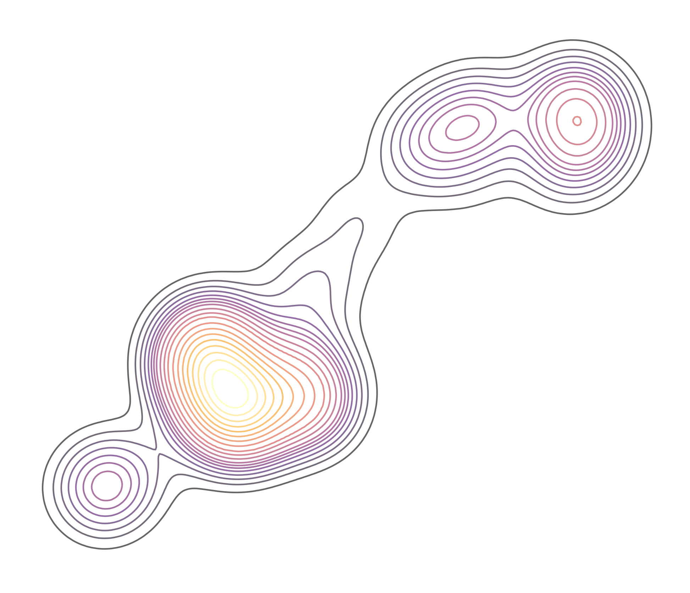

```{r, include=FALSE}
#This Resume/CV was built using custom CSS and Rmd's from https://github.com/nstrayer/cv

knitr::opts_chunk$set(
  results='asis', 
  echo = FALSE
)

library(glue)
library(tidyverse)
library(lubridate)
library(fontawesome)

# Set this to true to have links turned into footnotes at the end of the document
PDF_EXPORT <- FALSE

# Holds all the links that were inserted for placement at the end
links <- c()

source('parsing_functions.R')

# Load csv with position info
position_data <- read_csv('positions.csv', col_types = list(cv_description = "c")) %>% 
  mutate_if(is.character, list(~gsub("\\n", "\n", ., fixed=TRUE))) %>% #the list is so that I can use normal fxn syntax formula with the purrr style fxn creator ~
  mutate(start = parse_date_time(start, c("mdy", "y")), 
         end = parse_date_time(end, c("mdy", "y")),
         cv_description = str_split(cv_description,","),  #make a list for the cv_description column (i.e. which descriptions should be included in the cv)
         cv_description = map(cv_description,as.integer)) %>% 
  filter(in_cv) %>% 
  filter_descriptions(., type = "cv") #filter descriptions for cv (filter out resume specific columns)

```


```{r}
# When in export mode the little dots are unaligned, so fix that. 
if(PDF_EXPORT){
  cat("
  <style>
  :root{
    --decorator-outer-offset-left: -6.5px;
  }
  </style>")
}
```


Aside
================================================================================


{width=100%}

```{r}
# When in export mode the little dots are unaligned, so fix that. 
if(PDF_EXPORT){
  cat("")
} else {
  cat("[<i class='fas fa-download'></i> Download a PDF of this CV](https://github.com/jacpete/Resume_CV/raw/master/cv_Peterson.pdf)")
}
```

Contact {#contact}
--------------------------------------------------------------------------------
```{r include=FALSE}
iconhgt <- 12
```

<i class="fa fa-envelope"></i> jacobmpeterson12@gmail.com  
<!-- `r fa("twitter", fill = "#1DA1F2", height = iconhgt)` [PetersonJacobM](https://twitter.com/PetersonJacobM)   -->
<i class="fa fa-github"></i> [github.com/jacpete](https://github.com/jacpete//)  
<i class="fa fa-phone"></i> +1 (913) 449-1623


Skills {#skills}
--------------------------------------------------------------------------------


Highly experienced with

- `r fa("r-project", fill = "steelblue", height = iconhgt)` Program R 
-  ArcGIS
- `r fa("linux", fill = "black", height = iconhgt)` Linux/Bash
- `r fa("markdown", fill = "black", height = iconhgt)` R Markdown

Experience with

-  Python
-  SQL
-  QGIS
-  Netlogo  


Disclaimer {#disclaimer}
--------------------------------------------------------------------------------

Made with the R package [**pagedown**](https://github.com/rstudio/pagedown). 

The source code is available at [github.com/jacpete/Resume_CV](https://github.com/jacpete/Resume_CV).

Last updated on `r Sys.Date()`.


Main
================================================================================

Jacob Peterson {#title}
--------------------------------------------------------------------------------


```{r}
intro_text <- ""

cat(sanitize_links(intro_text))
```


Education {data-icon=graduation-cap data-concise=true}
--------------------------------------------------------------------------------

```{r}
print_section(position_data, 'education', type = "cv")
```

<br>


Research Experience {data-icon=laptop}
--------------------------------------------------------------------------------

```{r}
aside <- createAside(numBreaks = 7, 
                     body = "My research experience has allowed me to develop and hone my skills in programming, data management, statistics, and GIS that will be transferable to any field.",
                     list = FALSE)

print_section(position_data, 'research_positions', aside = aside, asidePos = 2, type = "cv")
```

<br>


Field Experience {data-icon=globe-americas}
--------------------------------------------------------------------------------


```{r}
aside <- createAside(numBreaks = 5, 
                     body = "My field experience includes working alone and as a small team in difficult terrain in a large range of weather conditions. I have used a multiple models of Garmin and Trimble GPS's and VHF reciever systems.",
                     list = FALSE)

print_section(position_data, 'field_positions', aside = aside, asidePos = 1, type = "cv")
```

<br>


Teaching Experience {data-icon=chalkboard-teacher}
--------------------------------------------------------------------------------

```{r}
aside <- createAside(numBreaks = 3, 
                     body = "I have a passion for teaching those that traditionally would consider themselves non-programmers how scripting and programming can make them more efficient at their jobs. I am also a advocate for free and open source options that allow fully reproducable science.",
                     list = FALSE)

print_section(position_data, 'teaching_positions', aside = aside, asidePos = 1, type = "cv")
```


Posters & Talks {data-icon=chart-line}
--------------------------------------------------------------------------------


```{r}
print_section(position_data, 'posters_talks', type = "cv")
```


Publications {data-icon=book}
--------------------------------------------------------------------------------

```{r}
print_section(position_data, 'academic_articles', type = "cv")
```


```{r}
if(PDF_EXPORT & length(links) > 0){
  cat("
  
Links {data-icon=link}
--------------------------------------------------------------------------------

<br>


")
  
  walk2(links, 1:length(links), function(link, index){
    print(glue('{index}. {link}'))
  })
}
```


