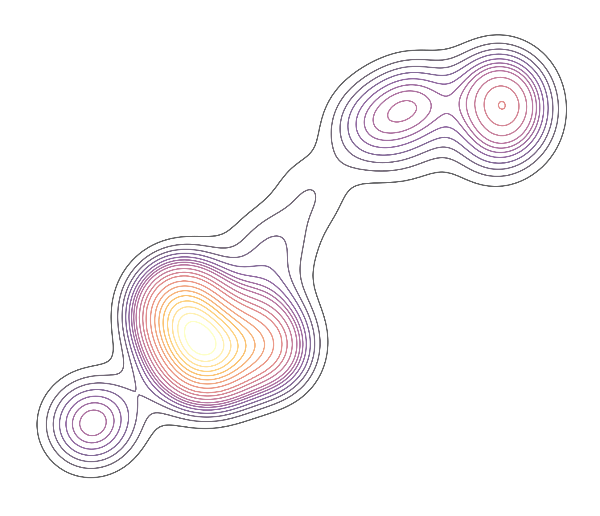

```{r setup, include=FALSE}
#This Resume/CV was built using custom CSS and Rmd's from https://github.com/nstrayer/cv


knitr::opts_chunk$set(
  results='asis', 
  echo = FALSE
)
library(tidyverse)
library(glue)
library(lubridate)
# devtools::install_github("rstudio/fontawesome")
library(fontawesome)

# Set this to true to have links turned into footnotes at the end of the document
PDF_EXPORT <- TRUE

# Holds all the links that were inserted for placement at the end
links <- c()

source('parsing_functions.R')


# First let's get the data, filtering to only the items tagged as
# Resume items
position_data <- read_csv('positions.csv', col_types = list(resume_description = "c")) %>% 
  mutate_if(is.character, list(~gsub("\\n", "\n", ., fixed=TRUE))) %>% #the list is so that I can use normal fxn syntax formula with the purrr style fxn creator ~
  mutate(start = parse_date_time(start, c("mdy", "y")), # parse the dates correctly
         end = parse_date_time(end, c("mdy", "y")),
         resume_description = str_split(resume_description,","),  #make a list for the resume_description column (i.e. which descriptions should be included in the resume)
         resume_description = map(resume_description,as.integer)) %>%  
  filter(in_resume) %>% 
  mutate(
    # Build some custom sections by collapsing others
    section = case_when(
      section %in% c('research_positions', 'field_positions') ~ 'positions', 
      TRUE ~ section
    )
  ) %>% 
  filter_descriptions(., type = "resume") #filter descriptions for shortened resume


```


Aside
================================================================================


<!-- {width=100%} -->

Contact {#contact}
--------------------------------------------------------------------------------


```{r include=FALSE}
iconhgt <- '12pt'
```

<i class="fa fa-envelope"></i> [JacobPetersonMSc@gmail.com](mailto:jacobpetersonmsc@gmail.com)  
<!-- `r fa("twitter", fill = "#1DA1F2", height = iconhgt, width = iconhgt)` [PetersonJacobM](https://twitter.com/PetersonJacobM)   -->
<i class="fa fa-github"></i> [github.com/jacpete](https://github.com/jacpete//)  
<i class="fa fa-phone"></i> +1 (913) 449-1623


Software Skills {.skills}
--------------------------------------------------------------------------------

```{r, results='asis'}

iconhgt <- 12
scaleIconSize <- function(base=12, scale = 1, unit="pt") {
  return(paste0(as.character(base*scale), unit))
}

tibble::tribble(
  ~Software,         ~Years, ~Rank5,  ~Include,  ~IconHTML,
  "R",               2015,   5,        TRUE,     paste0("`", as.character(fontawesome::fa("r-project", fill = "steelblue", height = scaleIconSize(base=iconhgt))), "`{=html}"),
  "Git/GitHub",      2016,   5,        TRUE,     paste0("`", as.character(fontawesome::fa("github", fill = "black", height = scaleIconSize(base=iconhgt))), "`{=html}"),
  "Linux/Bash",      2016,   3.5,      TRUE,     paste0("`", as.character(fontawesome::fa("linux", fill = "black", height = scaleIconSize(base=iconhgt))), "`{=html}"),
  "Rmarkdown",       2018,   4,        TRUE,     paste0("`", as.character(fontawesome::fa("markdown", fill = "black", height = scaleIconSize(base=iconhgt))), "`{=html}"),
  "Python",          2018,   3.5,      TRUE,     as.character(glue::glue('')), 
  "SQL",             2018,   3.5,      TRUE,     as.character(glue::glue('')),
  "HTML/CSS",        2019,   3,        TRUE,     as.character(glue::glue('')),
  "Shiny",           2020,   3,        TRUE,     as.character(glue::glue('')),
  "JavaScript",      2020,   2.5,      TRUE,     paste0("`", as.character(fontawesome::fa("r-project", fill = "steelblue", height = scaleIconSize(base=iconhgt))), "`{=html}"),
  "ArcGIS",          2016,   4,        FALSE,    as.character(glue::glue('')),
  "HPC",             2018,   4,        TRUE,     as.character(glue::glue(' ')),
  "QGIS",            2017,   3.5,      FALSE,    as.character(glue::glue('')),
  "Arrow",           2021,   3,        TRUE,     as.character(glue::glue(''))
) %>% dplyr::mutate(
  Years = lubridate::year(Sys.Date()) - Years,
  Bullet = glue::glue("*  {IconHTML} {Software} [{Years} years]  ")
) %>% 
  dplyr::arrange(dplyr::desc(Years), Software) %>% 
  dplyr::filter(Include) %>% 
  dplyr::pull(Bullet) %>% glue::glue_collapse(sep = "\n")

```


Technical Skills {.skills .bullet}
--------------------------------------------------------------------------------

- Data Management
- Data Cleaning/Unit Testing
- Data Visualization/Cartography
- Data Mining
- Statistical Analysis
  - GLMs/GLMMs
  - Categorical Analysis
  - Multivariate Analysis
  - Machine Learning
  - Bayesian Statistics
- Spatial Analysis
  - Geospatial Operations
  - Interpolation
  - Space Use Models
  - Movement Models


Professional Skills {.skills .bullet}
--------------------------------------------------------------------------------

- Critical thinking
- Independent learning and researching
- Project management
- Working effectively in a team
- Collaboration with external agencies and stakeholders
- Prioritize stakeholder needs in development
- Oral and written communication adapted to target audiences


<!-- More info {#more-info} -->
<!-- -------------------------------------------------------------------------------- -->

<!-- See full CV at [github.com/jacpete/Resume_CV/ cv_Peterson.pdf](https://github.com/jacpete/Resume_CV/raw/master/cv_Peterson.pdf) for a more complete list of positions and experience. -->


<!-- Disclaimer {#disclaimer} -->
<!-- -------------------------------------------------------------------------------- -->

<!-- Made w/ [**pagedown**](https://github.com/rstudio/pagedown). -->

<!-- Source code: [github.com/jacpete/Resume_CV](https://github.com/jacpete/Resume_CV). -->

<!-- Last updated on `r Sys.Date()`. -->


Main
================================================================================

Jacob Peterson {#title}
--------------------------------------------------------------------------------

```{r}
# intro_text <- ""
# intro_text <- "My career has given me experience applying a broad range of statistical methodologies and honed me into expert in R programming. Academic research has prepared me  to think critically, learn new skills independently and quickly, manage complex projects, and collaborate within teams to achieve results. I enjoy exploring datasets, solving the puzzles that accompany analysis, and transforming raw data into the solutions used to answer important questions.
# I am currently looking for a data science position that allows me to solve pragmatic problems while leveraging my skills in data management and statistical analysis."
intro_text <- "My career has given me experience applying a broad range of statistical and spatial methodologies and honed me into expert in R programming and working with a GIS. Academic research has prepared me  to think critically, learn new skills independently and quickly, manage complex projects, and collaborate within teams to achieve results. I enjoy exploring datasets, solving the puzzles that accompany analysis, and transforming raw data into the solutions used to answer important questions.
I am currently looking for a data science position that allows me to solve pragmatic problems while leveraging my skills in data management, GIS, and statistical analysis."

intro_text %>% fancyParagraphSpacing()
```


Professional Experience {data-icon=suitcase}
--------------------------------------------------------------------------------

```{r}
asideText <- paste0(createAside(numBreaks = 2,
                                heading = "Professional Communication",
                                body = c("I have given talks about my graduate research at five professional conferences in the last two years",
                                         "I currently have two scientific articles up for peer-review in professional journals"),
                                list = TRUE, bullet = TRUE),
                    createAside(numBreaks = 5,
                                heading = "Additional Interests",
                                body =  c("Continued Learning - I am always in pursuit of new methods, code libraries, and ideas that could increase the efficiency or statistical rigor of my analyses. ",
                                          "Scientific communication - I enjoy explaining complex problems, statistical analyses, and their results to non-specialists.",
                                          "FOSS - I am an advocate for free and open source options that allow fully reproducible science and help others learn.",
                                          "Teaching/Mentoring - I have a passion for helping others discover how scripting and programming can make themselves more efficient."),
                                list = TRUE, bullet = TRUE),
                    createAside(numBreaks = 5, heading = "More Info",
                                body = 'See full CV at [github.com/jacpete/Resume_CV/ cv_Peterson.pdf](https://github.com/jacpete/Resume_CV/raw/master/cv_Peterson.pdf) for a more complete list of positions and experience.',
                                list = FALSE),
                    createAside(numBreaks = 17, 
                                body = glue(
                                  '<p class="disclaimer">Made w/ <a href="https://github.com/rstudio/pagedown" ><strong>pagedown</strong></a>.</p>
                                  <p class="disclaimer">Source code: <a href="https://github.com/jacpete/Resume_CV">github.com/jacpete/Resume_CV</a>.</p>
                                  <p class="disclaimer">Last updated on {Sys.Date()}.</p>'), 
                                list = FALSE), collapse = "\n")

# asideText <- createAside(numBreaks = 1,
#                          heading = "Special Interests",
#                          body = c("Continued Learning - I am always in search of new methods, code libraries, and ideas that could increase the efficiency or statistical rigor of analysis. ",
#                                   "Scientific communication - I enjoy explaining complex problems, statistical analyses, and their results to non-specialists.",
#                                   "FOSS - I am an advocate of free and open source software solutions that are easily accessible for others to use and learn from."),
#                          list = TRUE)

position_data %>% removeAdvisors() %>% 
  print_section('positions', aside = asideText, asidePos = 6, type = "resume")
# position_data %>% removeAdvisors() %>% print_section('positions')

```


Education {data-icon=graduation-cap data-concise=true}
--------------------------------------------------------------------------------

```{r}
position_data %>% removeAdvisors() %>% print_section('education', type = "resume")
```


Teaching Experience {data-icon=chalkboard-teacher}
--------------------------------------------------------------------------------

```{r}
# aside <- createAside(numBreaks = 3,
#                      body = "I have a passion for teaching others how scripting and programming can make themselves more efficient at their jobs. I am also a advocate for free and open source options that allow fully reproducable science.",
#                      list = FALSE)

# position_data %>% removeAdvisors() %>% print_section('teaching_positions', aside = aside, asidePos = 1, type = "resume")
position_data %>% removeAdvisors() %>% print_section('teaching_positions', type = "resume")
```


